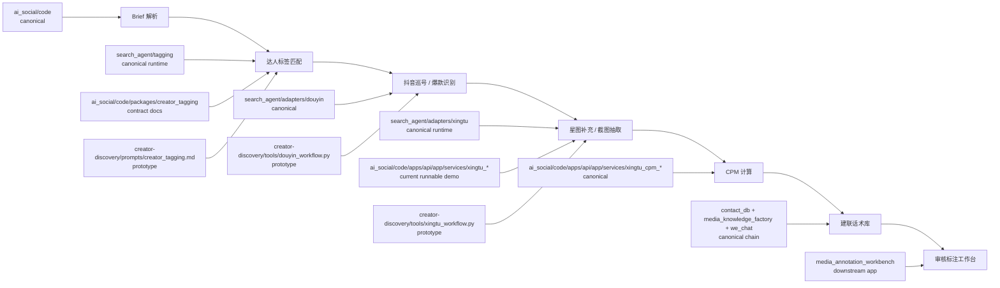

# Module Map

这张图描述当前 monorepo 的业务主链路，以及每一环的主实现、原型和下游消费关系。

## Stage Ownership

| Stage | Canonical | Supporting / Prototype | Main Inputs | Main Outputs |
| --- | --- | --- | --- | --- |
| `Brief 解析` | `ai_social/code` | `ai_social/code/packages/brief_parser` 文档层 | 自然语言 brief、表单输入 | 结构化 brief、需求约束、shortlist requirement |
| `达人标签匹配` | `search_agent/tagging` | `ai_social/code/packages/creator_tagging`、`creator-discovery/prompts/creator_tagging.md` | 结构化 brief、内容方向、行业语义 | 标签、匹配策略、筛选偏好 |
| `抖音巡号` | `search_agent/adapters/douyin` | `creator-discovery/tools/douyin_workflow.py` | 浏览器态、巡号规则、候选池 | 视频候选、达人基础信息、巡号记录 |
| `星图补充` | `search_agent/adapters/xingtu` | `ai_social/code` 星图流程、`creator-discovery/tools/xingtu_workflow.py` | 达人候选、星图搜索结果、截图 | 星图字段、商业化指标、截图解析结果 |
| `CPM 计算` | `ai_social/code/apps/api/app/services/xingtu_cpm_*` | `ai_social/code/packages/cpm_engine` 文档层 | 星图指标、OCR/VLM 结果、价格 | 播放预估、自然 CPM、预期 CPM、复核提示 |
| `建联话术库` | `contact_db` + `media_knowledge_factory` + `we_chat` | `ai_social/code/packages/contact_knowledge` 占位文档 | 聊天记录、微信 DB、brief 片段 | 训练样本、模板候选、知识卡、检索切片 |
| `审核标注` | `media_annotation_workbench` | 无 | 知识工厂快照、审核队列 | 任务领取、草稿、提交、审核结果 |

## Shared Layer

`common` 目前不强行上提为单独根包，而是先按“共享概念层”维护：

- `ai_social/code/packages/common/`
- `search_agent/models/`
- `search_agent/utils/`
- `search_agent/storage/`
- `search_agent/config.py`

后续如果多个子项目开始复用同一份运行时代码，再考虑抽成真正的顶层公共库。
