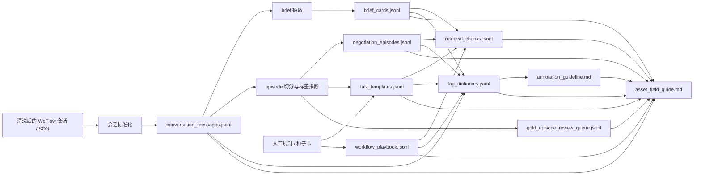

# Asset Field Guide

这份文档会把当前 V1 的 9 份核心资产串起来说明，既能给业务看整体流向，也能给中台看字段口径。

## 数据流转关系图

## 九份核心资产总览

| 文件 | 作用 |
| --- | --- |
| conversation_messages.jsonl | 标准化消息底座，保存逐条事实消息，所有上层资产都可回溯到这里。 |
| brief_cards.jsonl | 合作需求卡，沉淀品牌、档期、权益、分发和必确认项。 |
| negotiation_episodes.jsonl | 业务目标级谈判片段，是场景知识和训练样本的核心载体。 |
| talk_templates.jsonl | 参数化话术模板，兼容真实抽取和人工补种子卡。 |
| workflow_playbook.jsonl | 履约与协同 SOP 规则卡，支撑流程型检索。 |
| retrieval_chunks.jsonl | 面向 embedding / 向量搜索的切片产物。 |
| gold_episode_review_queue.jsonl | 人工金标审核队列，用于业务复核与评测集建设。 |
| tag_dictionary.yaml | 统一标签字典，约束字段和枚举口径。 |
| annotation_guideline.md | 人工标注和审核规范，约束 episode 切分与标签使用方式。 |

## conversation_messages.jsonl

用途：标准化消息底座，保存逐条事实消息，所有上层资产都可回溯到这里。

| 英文字段 | 中文名称 | 说明 |
| --- | --- | --- |
| message_id | 消息ID | 单条标准化消息的唯一标识。 |
| conversation_id | 会话ID | 同一达人会话的稳定主键。 |
| platform | 平台 | 消息来源平台，当前种子集固定为 `wechat`。 |
| channel_type | 渠道类型 | 沟通渠道类型，当前固定为 `private_chat`。 |
| creator_id | 达人ID | 达人统一身份主键。 |
| creator_aliases | 达人别名 | 达人代号、微信名、历史别名集合。 |
| media_id | 媒介ID | 媒介统一身份主键。 |
| media_name | 媒介名称 | 媒介展示名称。 |
| role | 说话角色 | 消息发送方角色，通常为 `agency` 或 `creator`。 |
| raw_text | 原始文本 | 源数据里的原始消息内容。 |
| clean_text | 清洗文本 | 脱敏、归一化后的可下游消费文本。 |
| timestamp | 时间戳 | 数值型时间戳，便于排序和对齐。 |
| formatted_time | 格式化时间 | 面向人工阅读的时间字符串。 |
| source_refs | 来源引用 | 回溯到原始导出文件和源消息的引用列表。 |
| evidence_span | 证据片段 | 该条消息在源记录中的证据范围或定位信息。 |
| source_file | 来源文件 | 该消息来自哪个原始输入文件。 |
| conversation_title | 会话标题 | 导出文件中的会话标题。 |
| seq_num | 顺序号 | 消息在会话内的顺序编号。 |

补充结构：

| 嵌套字段 | 中文名称 | 说明 |
| --- | --- | --- |
| source_refs[].file | 来源文件 | 原始文件路径或文件名。 |
| source_refs[].message_id | 源消息ID | 源消息或导出记录的标识。 |
| source_refs[].seq_num | 源顺序号 | 源记录在会话中的顺序。 |
| evidence_span.start | 证据起点 | 证据范围的起始位置。 |
| evidence_span.end | 证据终点 | 证据范围的结束位置。 |

## brief_cards.jsonl

用途：合作需求卡，沉淀品牌、档期、权益、分发和必确认项。

| 英文字段 | 中文名称 | 说明 |
| --- | --- | --- |
| brief_card_id | 需求卡ID | 单张 brief 卡片的唯一标识。 |
| conversation_id | 会话ID | 这张 brief 卡来自哪个达人会话。 |
| creator_id | 达人ID | brief 对应的达人。 |
| knowledge_base | 知识库归属 | 该记录属于哪类知识库。 |
| source_message_id | 主来源消息ID | 最主要的 brief 证据消息。 |
| source_message_ids | 来源消息ID列表 | 支撑这张 brief 卡的全部消息ID。 |
| platform | 投放平台 | 合作涉及的平台。 |
| brand | 品牌 | 品牌名或项目名。 |
| product | 产品 | 产品名、游戏名或推广对象。 |
| deliverable_type | 交付形式 | 内容形式与交付规格。 |
| content_direction | 内容方向 | 内容方向、剧情、卖点或选题要求。 |
| schedule_window | 档期窗口 | 发布时间或执行时间要求。 |
| rights_requirements | 权益要求 | 授权、二创、投流、不更新等要求。 |
| distribution_requirements | 分发要求 | 分发平台、免费分发、联动平台等要求。 |
| must_confirm_items | 必确认项 | 业务必须确认的关键问题。 |
| negotiable_items | 可谈项 | 可替代、可协商的条件。 |
| notes | 补充备注 | 其余值得保留的说明信息。 |

## negotiation_episodes.jsonl

用途：业务目标级谈判片段，是场景知识和训练样本的核心载体。

| 英文字段 | 中文名称 | 说明 |
| --- | --- | --- |
| episode_id | 片段ID | 单个业务目标片段的唯一标识。 |
| conversation_id | 会话ID | 所属达人会话。 |
| creator_id | 达人ID | 该片段对应的达人。 |
| knowledge_base | 知识库归属 | 该片段会进入哪类知识库。 |
| workflow_stage | 流程阶段 | 全链路阶段标签。 |
| episode_goal | 片段目标 | 当前片段的核心业务目标。 |
| objection_type | 阻力类型 | 最主要的推进阻力。 |
| agency_strategy | 媒介策略 | 媒介采用的谈判或推进策略列表。 |
| creator_response_type | 达人响应类型 | 达人侧响应风格或状态。 |
| outcome | 结果 | 该片段最终推进结果。 |
| evidence_message_ids | 证据消息ID | 用来支撑标注判断的关键消息ID。 |
| message_ids | 片段消息ID列表 | 该 episode 覆盖的全部消息。 |
| source_refs | 来源引用 | 回溯到原始消息和文件的证据引用。 |
| creator_traits | 达人特征 | 达人侧特征标签及证据集合。 |
| listed_price | 对外报价 | 达人报出的价格。 |
| target_price | 目标价格 | 媒介或客户期望达成的价格。 |
| current_rebate_rate | 当前返点率 | 对话中明确出现的当前返点比例。 |
| target_rebate_rate | 目标返点率 | 希望争取到的返点比例。 |
| rebate_target_status | 返点达标状态 | 当前返点是否达到目标。 |
| agency_margin_pressure | 毛利压力 | 媒介侧利润空间压力判断。 |
| rights_gap_status | 权益缺口状态 | 授权/分发等权益是否还有缺口。 |
| payment_blocker_type | 付款阻塞类型 | 付款相关的核心卡点。 |
| summary | 片段摘要 | 该段对话的高层摘要。 |
| confidence | 置信度 | 自动抽取结果的可信度。 |
| needs_review | 是否需复核 | 是否优先进入人工审核。 |

补充结构：

| 嵌套字段 | 中文名称 | 说明 |
| --- | --- | --- |
| creator_traits[].trait_name | 特征名 | 如 `order_saturation`、`interaction_style`。 |
| creator_traits[].value | 特征值 | 该特征的具体取值。 |
| creator_traits[].confidence | 特征置信度 | 该特征标签的可信度。 |
| creator_traits[].evidence_message_ids | 特征证据消息 | 支撑该特征判断的消息ID。 |
| creator_traits[].rationale | 判断依据 | 自动推断该特征的简要理由。 |

## talk_templates.jsonl

用途：参数化话术模板，兼容真实抽取和人工补种子卡。

| 英文字段 | 中文名称 | 说明 |
| --- | --- | --- |
| template_id | 模板ID | 单条话术模板唯一标识。 |
| knowledge_base | 知识库归属 | 模板进入哪类知识库。 |
| scenario_key | 场景键 | 阶段、目标、阻力拼出的稳定场景键。 |
| workflow_stage | 流程阶段 | 该模板适用的阶段。 |
| template_text | 模板正文 | 参数化后的话术文本。 |
| slots | 参数槽位 | 模板中需要动态替换的变量。 |
| applicable_conditions | 适用条件 | 适合使用这条模板的业务前提。 |
| risk_notes | 风险提示 | 使用边界、风险和注意事项。 |
| source_episode_ids | 来源片段ID | 该模板由哪些 episode 提炼而来。 |
| source_message_ids | 来源消息ID | 直接支撑模板的消息ID。 |
| origin | 来源类型 | 来自真实对话抽取还是人工种子补充。 |

## workflow_playbook.jsonl

用途：履约与协同 SOP 规则卡，支撑流程型检索。

| 英文字段 | 中文名称 | 说明 |
| --- | --- | --- |
| step_id | 步骤ID | SOP 规则卡唯一标识。 |
| knowledge_base | 知识库归属 | 所属知识库类型。 |
| workflow_stage | 流程阶段 | 该 SOP 所对应的流程阶段。 |
| trigger_condition | 触发条件 | 何种情况下进入这一步。 |
| required_inputs | 必需输入 | 执行该步骤前必须拿到的信息。 |
| recommended_action | 推荐动作 | 优先建议的执行动作。 |
| fallback_action | 回退动作 | 推进失败后的兜底动作。 |
| exit_condition | 退出条件 | 这一步完成或切换的标志。 |

## retrieval_chunks.jsonl

用途：面向 embedding / 向量搜索的切片产物。

| 英文字段 | 中文名称 | 说明 |
| --- | --- | --- |
| chunk_id | 切片ID | 检索切片唯一标识。 |
| chunk_type | 切片类型 | 如 `turn_chunk`、`episode_chunk`、`template_chunk`、`policy_chunk`。 |
| workflow_stage | 流程阶段 | 该切片对应的阶段标签。 |
| scenario_key | 场景键 | 用于场景级召回和过滤的稳定键。 |
| knowledge_base | 知识库归属 | 切片属于哪个知识库。 |
| embedding_text | 向量文本 | 真正送去做 embedding 的拼接文本。 |
| filter_tags | 过滤标签 | 向量召回前后的标签过滤条件。 |
| source_refs | 来源引用 | 回溯到消息、episode 或 SOP 的引用。 |
| confidence | 置信度 | 切片可靠度。 |
| metadata | 元数据 | 补充上下文信息，如 bucket、对象ID等。 |

补充结构：

| 嵌套字段 | 中文名称 | 说明 |
| --- | --- | --- |
| metadata.sft_bucket | 训练桶 | 该切片可归入哪个 SFT bucket。 |
| metadata.creator_id | 达人ID | 检索结果关联的达人。 |
| metadata.episode_id | 片段ID | 检索结果关联的谈判片段。 |

## gold_episode_review_queue.jsonl

用途：人工金标审核队列，用于业务复核与评测集建设。

| 英文字段 | 中文名称 | 说明 |
| --- | --- | --- |
| review_id | 审核任务ID | 人工复核任务唯一标识。 |
| episode_id | 片段ID | 待审核的 episode。 |
| conversation_id | 会话ID | 所属会话。 |
| creator_id | 达人ID | 对应达人。 |
| workflow_stage | 流程阶段 | 待审片段所处阶段。 |
| episode_goal | 片段目标 | 待审片段的业务目标。 |
| objection_type | 阻力类型 | 当前片段主阻力。 |
| priority | 审核优先级 | 当前任务的审核优先级。 |
| review_status | 审核状态 | 审核是否完成，默认 `pending`。 |
| source_refs | 来源引用 | 人工复核时要回看的原始证据。 |
| review_notes | 审核备注 | 业务审核人填写的备注。 |

## tag_dictionary.yaml

用途：统一标签字典，约束字段和枚举口径。

| 英文字段 | 中文名称 | 说明 |
| --- | --- | --- |
| schema_version | Schema版本 | 当前数据契约版本。 |
| core_objects | 核心对象定义 | 6 个核心对象及其字段说明。 |
| workflow_stages | 流程阶段字典 | 全链路阶段枚举及中文说明。 |
| episode_goals | 片段目标字典 | 常见业务目标枚举及说明。 |
| objection_types | 阻力类型字典 | 阻力枚举及说明。 |
| creator_traits | 达人特征字典 | 达人侧特征维度与可选值。 |
| commercial_state_fields | 商业状态字段字典 | 价格、返点、付款、权益等商业状态字段定义。 |
| chunk_types | 切片类型字典 | 检索切片类型说明。 |
| sft_buckets | 训练桶字典 | SFT 训练集的分桶口径。 |
| knowledge_bases | 知识库字典 | brief、谈判、话术、SOP 等知识库类别说明。 |

## annotation_guideline.md

用途：人工标注和审核规范，约束 episode 切分与标签使用方式。

| 英文字段 | 中文名称 | 说明 |
| --- | --- | --- |
| workflow_stage | 流程阶段标签 | 人工标注时判定对话处于哪个阶段。 |
| episode_goal | 片段目标标签 | 标记该段对话的主要业务目标。 |
| objection_type | 阻力类型标签 | 标记最影响推进的主阻力。 |
| creator_traits | 达人特征标签 | 达人是否缺单、风格、边界感、决策速度等。 |
| evidence_message_ids | 证据消息ID | 所有判断都必须有明确证据支撑。 |
| source_refs | 来源引用 | 要求标注和审核都保留可回溯引用。 |
| talk_template | 话术模板规则 | 规范哪些话术可沉淀为模板。 |
| retrieval_chunk | 检索切片规则 | 规范切片的用途和边界。 |
| sft_bucket | 训练桶 | 规定训练样本应该归入哪个训练桶。 |
| review_notes | 审核备注 | 人工金标时需要记录的审核补充说明。 |

## 使用建议

- 做消息追溯和证据核对时，优先看 `conversation_messages.jsonl`。
- 做场景级知识沉淀和训练样本生产时，优先看 `negotiation_episodes.jsonl`。
- 做模板召回时，用 `talk_templates.jsonl` + `retrieval_chunks.jsonl`。
- 做流程规则召回时，用 `workflow_playbook.jsonl` + `retrieval_chunks.jsonl`。
- 做统一口径校验时，以 `tag_dictionary.yaml` 和 `annotation_guideline.md` 为准。
